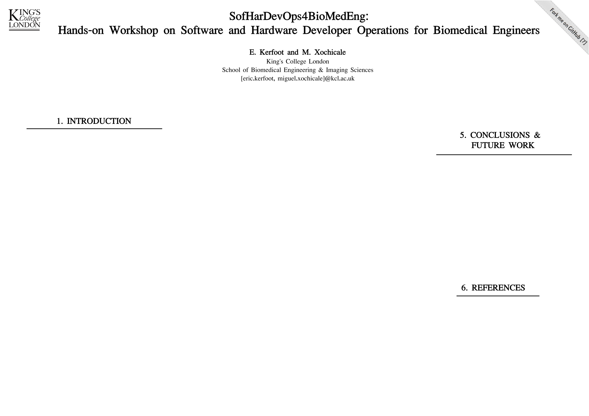

<h1 align="center">
:hammer_and_wrench: :octocat:	SofHarDevOps4BioMedEng: 

Hands-on Workshop on Software and Hardware Developer Operations for Biomedical Engineers
</h1>
<div align="center">
E. Kerfoot and M. Xochicale     

2nd conference on Reproducibility, replicability and trust in science 2022   
Cambridge, UK. 07–09 September 2022.
</div>


## Abstract 
In last decade, there has been a good response from the scientific community to adopt the full scientific replication, including code, data, and software (Peng 2011). 
However, there is a current need to adopt the best practices of fully scientific replication workflows to both software and hardware.
Recently, Diederich et al. 2022, for instance, highlighted the challenges of proper file-sharing and policies for hardware, which led Diederich et al. to suggest using guidelines of Open Source Hardware Association (OSHWA) and workshops for Open Hardware Makers as way to create more trustworthy science (Diederich2022).
Similarly, Stirling et al. 2022 proposed hardOps, hardware operations, as a way to address challenges in reproducibility for hardware, consisting on six stages: plan, design and document, prepare and verify, distributed production, physical testing, and feedback (Stirling 2022). 
Hence, following up our previous work on "open-corTeX: A framework for Continuously-integrated Open-source Reproducible TeX" (Xochicale 2020), this work presents a workshop on the best practices for Software and Hardware operations, aiming to equipping the next generation of Biomedical Engineers with appropriate skills and tools to create reproducible and trustworthy science.
The workshop contains six lessons on (1) introduction to git, GitHub, (2) project management, (3) continuous integration, (4) standards, (5) exercises and (6) examples of projects.

## Poster


## Content of the Workshop
1. Introduction to GitHub 
2. Project management  
3. Continous Integration
4. Standards
5. Software/Hardware projects
6. Exercises 

See further details [here](workshop).

## Clone repository
After generating your SSH keys as suggested [here](https://docs.github.com/en/github/authenticating-to-github/generating-a-new-ssh-key-and-adding-it-to-the-ssh-agent) (or [here](https://github.com/mxochicale/tools/blob/main/github/SSH.md) with few extra notes).
You can then clone the repository by typing (or copying) the following line in a terminal at your selected path in your machine:
```
mkdir -p $HOME/repositories/ && cd $HOME/repositories/ ## suggested path
git clone git@github.com:mxochicale/SofHarDevOps4BioMedEng.git
```

## References
https://coursesandconferences.wellcomeconnectingscience.org/event/reproducibility-replicability-and-trust-in-science-20220907

